# The Things Stack Application Cookbook

This is a guide for building an application or integration for The Things Stack.

> 🚧 This guide is work in progress.

This guide follows a number of best practices that will help you build scalable, reliable and yet simple applications:

- **Use Webhooks** to receive uplink traffic from The Things Stack. Webhooks require less resources than having to keep a connection to The Things Stack open at all times, or constantly polling The Things Stack for updates.
- **Decouple ingest from processing** with pub/sub queues. This allows you to add/remove additional processing pipelines without interrupting your other processing pipelines. When updating a processing pipeline, messages will be queued until your update processing pipeline is up and running.

The architecture of the application we'll build looks as follows:



- The Things Stack will send Webhooks to our server.
- A reverse proxy ([NGINX](https://nginx.org/)) forwards these Webhooks to an "ingest" pipeline ([Benthos](https://www.benthos.dev/)).
- The "ingest" pipeline checks the API key in the request, drops invalid Webhooks and publishes valid Webhooks on a Pub/Sub system ([Redis](https://redis.io/), [AMQP (RabbitMQ)](https://www.rabbitmq.com/) or [MQTT (Mosquitto)](https://mosquitto.org/)).
- The "process" pipeline (also [Benthos](https://www.benthos.dev/)) subscribes to the Pub/Sub system, de-duplicates messages (we don't want to process retries), and writes the messages to "outputs" (in the first version of this guide, just to stdout).

## Prerequisites

- A server with a public IP address.
  - It is **highly recommended** to use a hosted server. Unless you really know what you're doing, you probably shouldn't use a self-hosted server at home, behind a NAT or with a dynamic IP.
  - This guide was written while using a **DEV1-S** instance from [Scaleway](https://www.scaleway.com/) running **Ubuntu 20.04**.
- A domain name with a DNS record pointing at that public IP address.
  - This guide will use `placeholder.example.com` as a placeholder, and `integration.example.com` as "your domain".

## Basic Server Setup

Connect to the server over SSH:

```bash
% ssh username@integration.example.com
```

Make sure the system is up to date:

```bash
% sudo apt-get update

% sudo apt-get dist-upgrade

% sudo snap install core

% sudo snap refresh core
```

> ℹ️ You may want to reboot your server at this point.

Next, install some packages that we'll need to install the rest of the server:

```bash
% sudo apt-get install ca-certificates curl git gnupg lsb-release
```

## Downloading the Cookbook on the Server

It will be useful to have this guide and example files on your server, so let's download the entire cookbook.

```
% git clone https://github.com/htdvisser/lorawan-stack-application-cookbook cookbook
```

## Installing NGINX

```bash
% curl -fsSL https://nginx.org/keys/nginx_signing.key \
    | sudo gpg --dearmor -o /usr/share/keyrings/nginx-archive-keyring.gpg

% echo "deb [signed-by=/usr/share/keyrings/nginx-archive-keyring.gpg] \
http://nginx.org/packages/ubuntu `lsb_release -cs` nginx" \
    | sudo tee /etc/apt/sources.list.d/nginx.list > /dev/null

% sudo apt-get update

% sudo apt-get install nginx

% sudo systemctl enable nginx --now
```

## Installing Certbot

```bash
% sudo snap install --classic certbot
```

## Configuring NGINX and Certbot

We'll set up NGINX as a reverse proxy, with HTTPS certificates from Let's Encrypt that we'll request with Certbot.

> ℹ️ _tl;dr_ if you are already familiar with NGINX:
> - Proxy `https://integration.example.com/post/*` to `http://127.0.0.1:4195`

Copy the NGINX configuration from the cookbook directory to the NGINX config directory:

```bash
% sudo cp cookbook/nginx/nginx.conf /etc/nginx/nginx.conf
```

Copy the HTTP configuration from the cookbook directory to the NGINX config directory:

```bash
% sudo cp cookbook/nginx/conf.d/integration-http.conf \
  /etc/nginx/conf.d/integration-http.conf
```

Replace occurrences of `placeholder.example.com` in the HTTP configuration with your domain name (`integration.example.com`):

```bash
% sudo sed -i 's/placeholder.example.com/integration.example.com/g' \
  /etc/nginx/conf.d/integration-http.conf
```

Test the config, and reload NGINX:

```bash
% sudo nginx -t && sudo systemctl reload nginx
```

Use Certbot to request a Let's Encrypt certificate.

> ⚠️ Make sure to replace `integration.example.com` and `hello@example.com` before running this command:

```bash
certbot certonly \
  -n --agree-tos --force-renewal \
  --webroot -w /var/www/_letsencrypt \
  -d integration.example.com \
  --email hello@example.com --no-eff-email
```

Now we can copy the HTTPS configuration from the cookbook directory to the NGINX config directory:

```bash
% sudo cp cookbook/nginx/conf.d/integration-https.conf \
  /etc/nginx/conf.d/integration-https.conf
```

Replace occurrences of `placeholder.example.com` in the HTTPS configuration with your domain name (`integration.example.com`):

```bash
% sudo sed -i 's/placeholder.example.com/integration.example.com/g' \
  /etc/nginx/conf.d/integration-https.conf
```

Generate Diffie-Hellman keys on your server:

```bash
% sudo openssl dhparam -out /etc/nginx/dhparam.pem 2048
```

Again, we test the config, and reload NGINX:

```bash
% sudo nginx -t && sudo systemctl reload nginx
```

If everything worked, you'll see:

- A **404 Not Found** on https://integration.example.com/
- A **502 Bad Gateway** on https://integration.example.com/post

Finally, in order to make Certbot automatically reload NGINX when it updates certificates, copy `reload.sh` from the cookbook directory to the Certbot hooks directory:

```bash
% sudo cp cookbook/nginx/reload.sh /etc/letsencrypt/renewal-hooks/post/nginx-reload.sh
```

## Installing Docker and Docker-Compose

```bash
% curl -fsSL https://download.docker.com/linux/ubuntu/gpg \
    | sudo gpg --dearmor -o /usr/share/keyrings/docker-archive-keyring.gpg

% echo "deb [signed-by=/usr/share/keyrings/docker-archive-keyring.gpg] \
https://download.docker.com/linux/ubuntu `lsb_release -cs` stable" \
    | sudo tee /etc/apt/sources.list.d/docker.list > /dev/null

% sudo apt-get update

% sudo apt-get install docker-ce docker-ce-cli containerd.io

% sudo systemctl enable docker containerd --now

% sudo usermod -aG docker $USER && newgrp docker

% mkdir -p ~/.docker/cli-plugins/

% curl -fsSL https://github.com/docker/compose/releases/download/v2.1.1/docker-compose-linux-x86_64 \
    -o ~/.docker/cli-plugins/docker-compose

% chmod +x ~/.docker/cli-plugins/docker-compose
```

If everything worked, you can now run `docker run --rm hello-world` and you'll see something like:

```
[...]
Hello from Docker!
This message shows that your installation appears to be working correctly.
[...]
```

## Ingest Pipeline

The ingest pipeline is responsible for accepting Webhooks from The Things Stack, doing some basic filtering, and then publishing the messages on Pub/Sub.


The ingest pipeline consists of two files:

- `ingest/benthos.yaml` defines the configuration for our Benthos pipeline.
- `ingest/compose.yaml` defines the containers that will run in the deployment: Benthos, Redis, RabbitMQ and Mosquitto.

Each of these files contains blocks that can be commented out if you only want to use one pub/sub system.

Before we can deploy the pipeline, we need to generate an API key that we'll give to The Things Stack to authenticate webhooks:

```bash
% openssl rand -base64 24 | tee cookbook/ingest/apikey.txt
```

Now let's deploy the ingest pipeline:

```bash
% cd cookbook/ingest

% docker compose up -d
```

## Processing Pipeline

The processing pipeline is responsible for subscribing to Pub/Sub, and actually processing each message. In the first version of this guide, this processing only consist of de-duplication and writing to stdout, but in future updates we'll make it more exciting.



The processing pipeline consists of two files:

- `process/benthos.yaml` defines the configuration for our Benthos pipeline.
- `process/compose.yaml` defines the containers that will run in the deployment: for now just Benthos.

Each of these files contains blocks that can be commented out if you only want to use one pub/sub system.

Let's deploy the processing pipeline:

```bash
% cd cookbook/process

% docker compose up -d
```

You can now start following the logs to see messages come in when you enable the webhook integration in The Things Stack:

```bash
% docker compose logs -f
```

## Configuring the Webhook in The Things Stack

In The Things Stack, go to your application, then **Integrations** and **Webhooks**.

Click **Add Webhook**, then **Custom webhook** and configure it as follows:

- Choose a **Webhook ID**.
- Set the **Webhook format** to **JSON**.
- The **Base URL** is `https://integration.example.com/post`.
- Add an **Additional header** `X-APIKey` with as value the API key that we generated into `cookbook/ingest/apikey.txt` earlier.
- Under **Enabled messages** we'll only enable **Uplink message** and give it a path of `/up`.

Now save the webhook configuration.

If you have active end devices in your application, you'll now start seeing messages come in. Otherwise you can go to a device in the Console of The Things Stack and simulate uplinks from the **Messaging** tab.

## Future Work

See [enhancement issues](https://github.com/htdvisser/lorawan-stack-application-cookbook/labels/enhancement).
